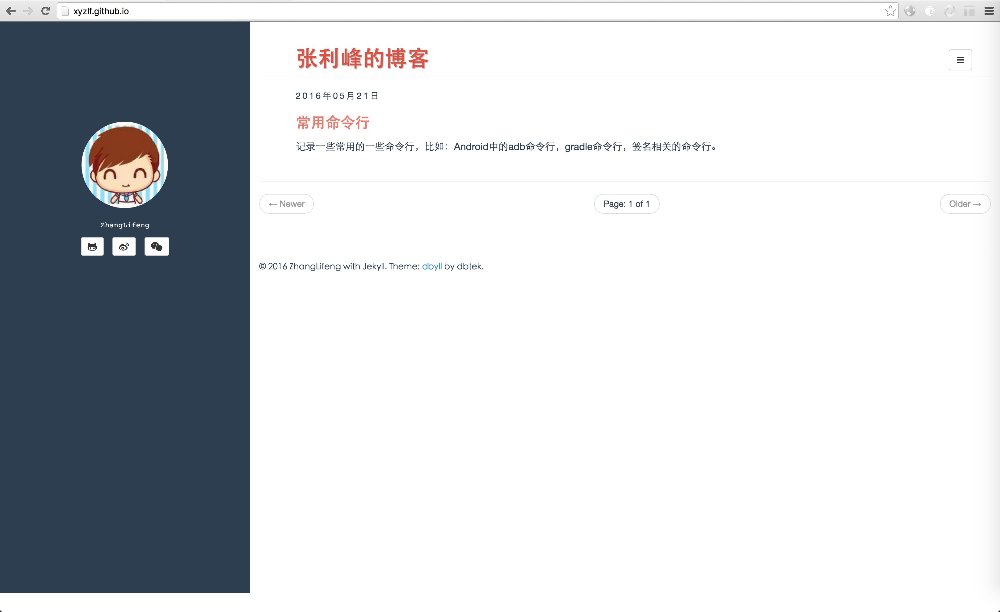

dbyll
=====

Open source stylish, minimalistic theme for jekyll.  
Demo: http://dbtek.github.io/dbyll/

## New
Dbyll for Ghost is now available. Get it [here](https://github.com/dbtek/dbyll-ghost) now.

### Features
- Responsive layout.
- Supports tags and categories.
- Social profile and bio of author.
- Bootstrap based.
- Glyphicon and Font-Awesome Icons.
- Pagination.
- Syntax highlighting with pygments.
- Disqus comments.

### Download
* [Download dbyll](https://github.com/dbtek/dbyll/archive/master.zip)

### Screenshots

### 如何配置域名
1. 向你的 Github Pages 仓库添加一个CNAME(一定要*大写*)文件，其中只能包含一个顶级域名，像这样：
	
		example.com
		
2. 向你的 DNS 配置中添加 3 条记录

		@          A             192.30.252.153
		@          A             192.30.252.154
		www      CNAME    username.github.io.
		
	用你自己的 Github 用户名替换 username。

3. 等待你的 DNS 配置生效

	对DNS的配置不是立即生效的，过10分钟再去访问你的域名看看有没有配置成功 : )

### License
- [MIT](http://opensource.org/licenses/MIT)

